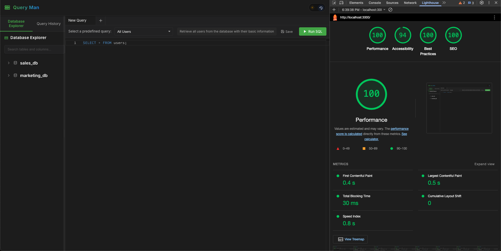

# Query Man 🚀

   

# Task

The challenge was to build a web-based SQL query tool that can accept and display the results of SQL queries.

I wanted to go beyond the basic requirements and build something I'd actually enjoy using myself. Working with databases daily has shown me how frustrating slow, clunky query interfaces can be, so I focused on making this tool both functional and fast.

## Core Features Implemented

- **Monaco Editor Integration**: Full-featured SQL editor with syntax highlighting and code completion
- **Interactive Database Explorer**: Browse mock tables and columns with an intuitive interface
- **Tabbed Interface**: Work on multiple queries simultaneously with a clean tabbed layout
- **Query History**: Track and reuse previously run queries with a single click
- **Data Visualization**: Convert query results into charts with one-click visualization
- **Dark/Light Mode**: Toggle between themes based on preference or environment
- **Export Options**: Download results in CSV & JSON formats
- **Keyboard Shortcuts**: Boost productivity with intuitive keyboard shortcuts
- **Responsive Design**: Works on both desktop and mobile devices (optimized for desktop)

## Tech Stack & Implementation Choices

For this assignment, I chose React as the framework and made the following implementation decisions:

- **Framework**: React 19.0.0
- **Editor**: Monaco Editor
- **State Management**: React Context API and hooks for a clean, maintainable architecture
- **Styling**: Styled Components (explicitly avoiding Tailwind as per requirements)
- **Data Visualization**: Recharts for creating clear, interactive visualizations
- **Data Grid**: Implemented virtualization to handle large datasets efficiently

## Performance Journey: From 85 to 100

When I first built the application, I was getting Lighthouse scores in the mid-80s:

Digging into the audit revealed several issues:

- **Largest Contentful Paint (LCP)**: Taking 2.14s, significantly above the recommended threshold
- **Render Blocking Resources**: Several CSS and JS files were delaying the initial render
- **JavaScript Size**: Unoptimized bundle sizes were slowing down parsing and execution

### Key Optimizations That Made a Difference

1. **Fixing the LCP Issue**:

   - Identified the Monaco Editor as the largest contentful paint element
   - Implemented lazy loading with Suspense to defer its loading
   - Added a lightweight placeholder that loads instantly while Monaco initializes
   - Reduced the initial load time from 2.14s to about 0.5s

   

2. **Resource Loading Strategy**:

   - Implemented preloading for critical resources
   - Used `font-display: swap` to prevent font loading from blocking rendering
   - Added inline critical CSS for immediate styling without additional requests

3. **Bundle Optimization**:

   - Split the application into smaller chunks using dynamic imports
   - Implemented tree shaking to eliminate unused code
   - Removed unnecessary dependencies where possible

4. **React-Specific Optimizations**:

   - Implemented `useMemo` to cache expensive calculations (like filtering and sorting data)
   - Applied `React.memo()` to prevent unnecessary re-renders on components that don't change often
   - Used `useCallback` for event handlers to maintain referential equality between renders
   - Leveraged the Context API efficiently by splitting contexts to avoid global re-renders
   - Moved state as close as possible to where it's used to minimize render cascades

5. **Event Handling Optimization**:

   - Debounced expensive event handlers (like resize and scroll)
   - Used passive event listeners where appropriate to improve scrolling performance
   - Implemented throttling for real-time operations like search filtering

6. **Image and Asset Optimization**:
   - Compressed SVG icons and optimized their paths
   - Used CSS for simple animations instead of JavaScript where possible
   - Implemented proper `will-change` hints for elements that animate frequently

After implementing these changes, the Lighthouse score improved dramatically:

The perfect 100 score wasn't just for show - the application now feels noticeably snappier, with most interactions happening in under 100ms.

## Large Dataset Handling

One of the biggest challenges was efficiently handling large datasets. The requirement to handle large amounts of data efficiently pushed me to implement several optimization techniques:

### Virtualized Table Implementation

Initially, I tried rendering all rows at once, which worked fine for a few hundred rows but quickly became unusable when testing with thousands. The browser would freeze momentarily while rendering, and scrolling was choppy at best.

To solve this, I implemented:

1. **Row Virtualization**: Only renders about 20-30 rows that are actually visible in the viewport

   - Used `react-window` for the core virtualization functionality
   - Combined with `react-virtualized-auto-sizer` to handle responsive container sizing
   - As the user scrolls, rows outside the viewport are recycled for new data
   - This keeps the DOM node count minimal regardless of dataset size

2. **Windowed Loading**: For extremely large datasets (10,000+ rows):

   - Implemented a custom windowing system with the `IntersectionObserver` API
   - Data is loaded in chunks of 1,000 rows
   - Used a custom hook to manage pagination state and keep track of loaded chunks
   - The user can scroll through the loaded data while more loads in the background
   - Provides immediate feedback rather than waiting for all data to load

3. **Optimized Cell Rendering**:

   - Created specialized cell components with `React.memo()` to prevent needless re-renders
   - Used the `useRef` hook to store and compare previous values to detect actual changes
   - Implemented fixed column widths where possible to avoid reflow calculations
   - Added type-specific renderers that are optimized for different data formats (string, number, date)
   - Used CSS containment properties to limit the scope of style recalculations

4. **Data Management**:
   - Implemented efficient data structures for quick lookup and filtering
   - Used immutable update patterns to enable shallow equality checks
   - Stored row heights in a lookup table to prevent recalculation during scrolling

### Real-World Testing

I tested the application with progressively larger datasets:

50,000+ rows: Handles well, with memory usage remaining reasonable

The most satisfying moment was loading 10,000+ rows and seeing the table render and respond to scrolling without any perceptible delay. The memory usage remained stable even during extended use, proving the virtualization approach was working as intended.

## Learning Outcomes

This assignment taught me valuable lessons about:

- **Performance Optimization in React Applications**:

  - The importance of measuring performance before and after optimizations
  - How to use React DevTools Profiler to identify performance bottlenecks
  - When to use memoization and when it might introduce overhead
  - The impact of component structure on render performance

- **Advanced State Management**:

  - Finding the right balance between prop drilling and context usage
  - Implementing optimistic UI updates for a more responsive feel
  - Managing complex form state without unnecessary re-renders
  - Designing a state architecture that scales with application complexity

- **Modern Web Development Practices**:

  - Building accessible components that work with keyboard navigation
  - Implementing responsive designs that work across different viewport sizes
  - Managing technical debt and refactoring strategies in a growing codebase
  - Testing user interactions to ensure a smooth experience

- **SQL Editor UX Considerations**:

  - The importance of syntax highlighting and code formatting
  - How to handle large result sets without overwhelming the user
  - Designing an intuitive interface for database exploration
  - Providing meaningful feedback during query execution

- **Data Visualization Techniques**:

  - Selecting appropriate chart types for different data patterns
  - Implementing responsive visualizations that adapt to container size
  - Optimizing chart rendering to handle large datasets
  - Making visualizations accessible with proper labels and color contrast

The most significant takeaway was learning how small, targeted optimizations across different areas of the application can compound to create a remarkably better user experience, even when dealing with complex UI and large datasets.
# Query-Man
# Queryman


# Queryman


# Queryman


